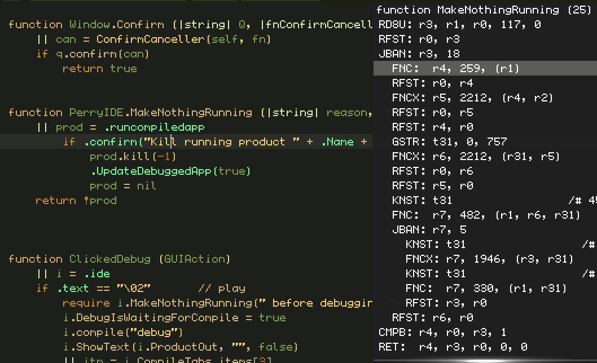

## The 🍰 Cake 🍰 VM (unfinished but getting closer)

Speedie's Virtual Machine, "`Cake`", is a perfect match for Speedie. It compiles code to 2-3x smaller than ARM code on average, improving VM speed.

Speedie doesn't require `Cake` to run it's programs. Speedie can output C++ and compile that.

`Cake` makes new things possible!

* Debugging is easy and fun
* Cross-platform distributables, run on any platform with speedie installed
* Some "[temporal](#user-content-temporal)" magic and mystery (optional)
* Directly write `Cake`-ASM! (For fun or learning about ASM)
* Compiles without needing gcc/clang

### Cake is Fast, Small and Tasty

`Cake` is a low-calorie platform, at around 2-3x smaller than ARM. `Cake` also links against SpeedieLib, drastically reducing size. The (very featureful) IDE [`Perry`](Perry.md) compiles to 80KB in Cake! _(For ARM-C++ it takes 900KB.)_

**Comparison notes:** _If I say (2 vs 13), that means `Cake` takes 2 instructions to do something, and ARM would take 13 to do the same._

* RefCounting instructions (1-2 vs 16-32).
* Function-calls are expressed cleanly. Tighter, smaller, faster. Far superior design. (2 vs 2-20, typically 2 vs 10)
* Many low-level math instructions, the compiler will automatically insert them. These include:
    * `Div2` (fast divide by power of 2, on signed ints)  (1 vs 2)
    * Integer `Min` / `Max`  (1 vs 3)
    * Multiply or add by immediate constants, on both ints and floats (1 vs 2)
    * Increment/decrement memory (1 vs 3)
* 64-bit direct constants (and 48-bit and 16-bit versions) without needing to load from a separate location.
* Branching (1 vs 2)
* Loop specific instructions do in (1 vs 3-4).

`Cake`'s instruction count is around 190. This includes all the SIMD instructions for faster graphics, replicating the functions of OpenGL/GLSL. (I'll probably add a few more before release, but not many.)

`Cake` is simple to decode. Instructions are 4-bytes each, except for instructions from 0 to 31. In this range, they take either 8 or 12 bytes, depending on if the instruction index is odd or even. (This should make it faster if we ever make a physical `Cake` CPU.)

### Perry's Cake-View

People who have used [godbolt.org](http://godbolt.org) know how useful this tool is. It is used for all sorts of things, but mostly to check if your code compiles to code that is as good as you know it can be. Or to avoid disasterous compiler-bugs that lower efficiency unexpectedly. Such as refusing to use SIMD when it should.

Well... Perry has an inbuilt ASM-Viewer! Just press **Command-6** (**Ctrl-6** on Linux) to view the `Cake` ASM for any function you are editing. `Cake` is optimised "tastefully", to make a good balance of debuggability and speed, usually maxing both out at the same time. (Its usually easier to debug smaller code!)

And considering that Speedie only has one compile-target (release builds ARE debug-builds), this means you can easily check the final output of your code.

Perry's inbuilt ASM-viewer... has an extra advantage, it is instant! (Unlike godbolt.org)

### Other Nice Things To Know:

• Within 1.5 years of community acceptance, a `Cake` JIT will be created for ARM, running `Cake` apps on ARM at native speed.

• `Cake` allows to hand-writen ASM that runs on any platform. It will be a great way to learn ASM!

• `Cake` has many SIMD instructions... useful for 3D graphics, audio, etc.

• `Cake` is always fully optimised, even debug-builds. The only difference is that release-builds will remove debug-only code from your code-base. This is code that YOU marked as debug. For example:

    function Example (|string| name)
        target debug
            expect (name != "") ("Empty name passed")
            // programmer expects this never to happen in release due to other checks earlier
        
        printline name

This makes debugging your apps much simpler, as you are less likely to get a difference between your "release" and "Debug" version. Usually, they can just be the same program!

### Future Possibility: Temporal

What if we added a "temporal" mode to `Cake`? This is where we basically use our code for art... mystery and magic, or anything kind of dreamy or intuitive. You can see it as "divination", like reading tea-leaves or reading tarot-cards.

Basically, we record the amount of time it takes for your code to run, per-instruction. Running your code will now generate a large amount of fresh data. *(This entire thing will be an optional feature).*

Because the CPU is a physical thing... the amount of **time** it takes to do anything is unpredictable. No matter what input is given... the output can't be mathematically predicted. That is because it comes from the soul... or at least why not? Why not use your willpower to change the effects of the dice-roll? Thats what most dungeons and dragons players believe in anyhow (hahaha).

This temporal output can be used to create interesting textures or patterns that come out of the heart of your CPU's inner world... Or be used for "electronic divination", perhaps even "mind-machine-interfaces", art. Or randomness input for games and more.

The best example of this is like when you are playing a computer game, and the RNG just happens to create some very annoying or funny event for you.

Did the gods arrange this event? Did this happen for some deeper reason? Well... who knows, but we hope that the temporal engine will increase the level of such occurances.

The question about this being "unscientific" isn't really a good point, because it is statistically proven such mind-machine effects do exist. The question of **what** it means if anything... or how useful it is... is one I have absolutely no idea about :) But its useful to explore and play with. That is all.

The question shouldn't be about how *scientific* this is... but is it *fun* or *meaningful*. Tarot-cards, iChing and divination in general are also "unscientific". But they are popular and mean a lot to many people and help them through life. That is the kind of thing we want to aim for with the temporal engine.

#### Lets Go Further

In fact... we want to further with this! Lets go deeper. Each program in unix has `stdin` and `stdout`. So that is a balanced thing, we have input and output, positive and negative.

But we also have `stderr`, which is a bad thing. We want to avoid creating errors. What if all apps had a good thing, to balance that out? Like `stdfun` or `stdvibe`? Some positive or pleasant output from your programs. And it was there, by standard, in **all** programs (if you didn't disable it for speed).

Well... that `stdvibe` output... could just be the temporal-engine. Something that "outputs pleasant or good info" to be used in some artistic or game-purposes.

Perhaps to let the computer "get a feel" if it likes the code it is running, or not. In fact... in the future we could go even further... by making a temporal AI-VM. This is where you get an AI to analyse the temporal-output... to do the interpretation for you. You could even make the AI itself generate temporal-info as a result of it's own operation, then interpret the result. So its a way to make a computer "feel itself"...

So we'll be making a `magic-cake`.

Interesting possibilities. Definitely these are side projects... but something fun to work on when there a gap in other work :)

