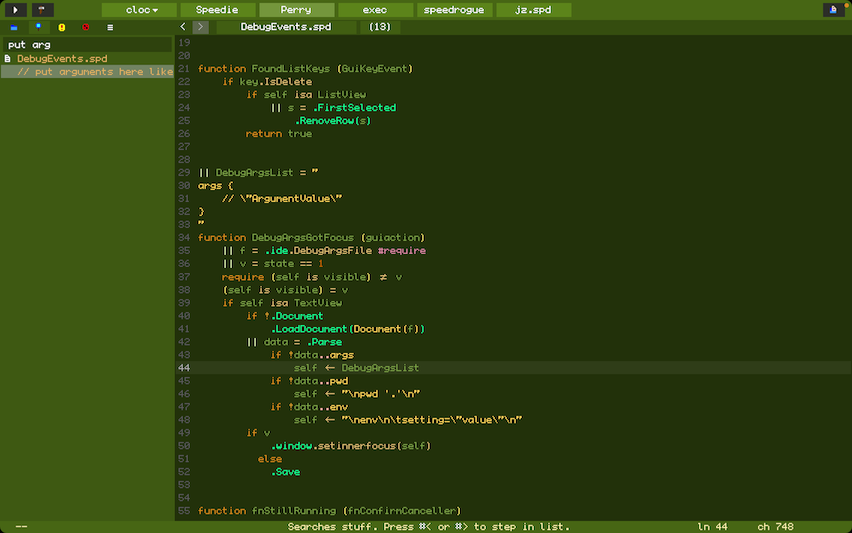

# Perry - The IDE for Speedie

Perry is an IDE, that means it aims to do all the things that help you write good code.

Perry is designed with minimalism in mind, we won't blast your eyes with all sorts of clutter and details.

In fact Perry goes out of it's way to hide clutter. Hopefully this will let you focus on the code more easily. Especially if you are new!

I wanted full support for Speedie, and I refuse to be a second-class citizen. Thats what I created my own IDE.

You'll see that it looks simple. But underneath that simplicity, is a huge amount of features carefully hidden.

## Perry Features
* File-List auto-discovers your project files.
* Anti-Clutter interface
* Error-List lets you jump to error-locations.
* Batch-Find
* Remembers your last projects used, and what files you were last editing.
* Multi-Project, Tabbed Interface.
* Syntax Coloring
* Auto-Complete
* Build and Run programs (can build multiple projects at once)
* Awesome quick file-finding feature.
* Inbuilt todo list
* Text editor is pretty good. I like it about as much as BBEdit.
* Log area to see your programs text output
* Multi-root interface, in case your project relies on libs you created, and you want to edit those libs too.
* Right-Click on any function or variable to see where it is defined, and even what other functions call it!
* Hold control key (linux/windows) or command key (OSX) down, over any variable or function, to see how it is defined.
* Function-List Menu, lists all functions in the current file and has a editable-filter to narrow down the func you are hunting for.
* File-History Menu and buttons, lists all files previously viewed, or lets you skip forward/backward. The File-History is filterable.

## Great Care

Each of these features was designed expertly and to a high degree of care. For example:

* The tabbed interface, lets you work on multiple projects at once! This lets you see if a change in one project, breaks other projects. This is useful if you are creating a library that many projects of yours use, and want to be quickly warned if the change breaks other projects of yours.

* The inbuilt todo list, is available by clicking on your current project's tab. Clicking again returns you. I find this invaluable for my project management. This means your todo-list is always at-hand. Really vital.

* The quick file-finding feature, is accessed via Cmd-D (control-D on Linux). This brings up a list of files that contain the name. You can also paste file-paths in there, to see all the files in that folder.

## Speed And Efficiency

Perry is light, fast and small. Perry weighs at only 1500KB on OSX. Compare that to Xcode which can be over 20GB, (13333x bigger). Incredible that Perry is so small. This is partly because Perry is made in Speedie, which is a great compiler.

Perry reminds us of the kind of programs you used to like and enjoy maybe 20 years ago... fast programs that do a lot... without all the bloat.

In Perry, you'll find that finding is fast, text-editing is fast, autocomplete is fast, clicking on functions to find more info about them, is fast... Everything is fast.

I find Perry takes surprisingly little RAM. When I open Perry I see I have 6 projects open (3 are large projects). Yet I am only taking 1.5MB of memory for all the objects, 87KB for the strings, and 1.7MB for the screen. Its an ultra-light-weight design. Xcode will take hundreds of megabytes for just one project, and gigabytes to compile.

## Comparisons

#### BBEdit + Xcode

When opening large files, Perry will run much much faster.

#### Xcode

Syntax coloring is instant, unlike in Xcode.

Xcode has a giant [bloated IDE](https://www.google.com/search?q=xcode+bloated). And a super-confusing Build and Scheme and Task window system thingy that I still don't fully understand after using it for over 15 years.

Xcode STILL regularly breaks file-paths in such ways that takes very careful manual hacking of projects raw hidden data-files, to fix.

Perry is sleek and simple in that regard. Creating a new project is a single-click process, opening an existing project is also. In fact Perry doesn't require you to manually add files, they are auto-discovered.

#### VSCode
vscode is slow, bloated and confusing. I hate using it. Perry is fast and light.

Last time I needed vscode for C++, it took me over an hour to setup. I needed tutorials because nothing is obvious, I had to install plugins, then configure "build" and "task" json files... then debug them when they aren't working, editing json is a nightmare. At each step I'm finding the tutorials aren't quite right, so I need to (stressfully) guess about how to fix the task-file. I **HATED** it.

And after all that, the C++ debugging experience was slow!

Perry on the other hand, there really is no project setup. You just open a project in perry, and it sees all your files, you can compile, run and use it. There is zero project setup. There isn't even a .proj file. Theres none!

## Simplicity

Let make a whole section out of that last point. Perry's overall design is to make your life simple.

When you have a project in vscode or xcode, there is a .vscode or .xcodeproj file. In Xcode's case, that file is usually quite large.  In fact my .xcodeproj files are normally 1.5MB to 2.1MB large. Thats 1.5MB **more** than nothing!

**In Perry, there is no such file.** The source code that the compiler needs for your project, is enough for Perry to understand when opening that project.

There is one exception, but thats more of a nicety. Perry has a "multi-root" interface, and those roots need to be specified somewhere. We specify that in an invisible ".perry" file in your project's root.

But if that ".perry" file does not exist, everything still works. Its only needed for multiple-root projects.

Perry can also edit single-file projects, or even plain text-files. Its good at all of it. I actually prefer Perry as a text-editor to BBEdit.

## Retro Feel
Actually, with Perry and the GUI, I'm going for more of a retro-feel. More like Sega-Megadrive or Terraria style level of complexity and detail.

So if you like retro-gaming... this might be a good IDE for you.

Regarding the color-scheme, that can and will change over time. Currently I have a green-theme, but later I will allow skins to be available.

I'll probably allow rounded buttons with pictures for backgrounds later, perhaps we can make the IDE look like something from a Civilisation Game or something :) Or a "my little IDE" kind of Hello Kitty theme, or all sorts of possibilities.

## Remaining Challenges
I still prefer Xcode sometimes. I'm actually going to continue to improve Perry, until I prefer Perry in all areas, but right now here are some areas that Xcode is better (for me).

* Smooth fonts are nice in Xcode. Perry has a low-res pixel-art font thats great on a low-res screen. But not ideal on high-DPI monitors. Smooth fonts would fix this.
* Perry's text-editor still needs a few tweaks.
* Needs a debugger and VM
* Needs skinning and themes
* Maybe we could animate the text or add explosions or animations into Perry. That would be cool.

