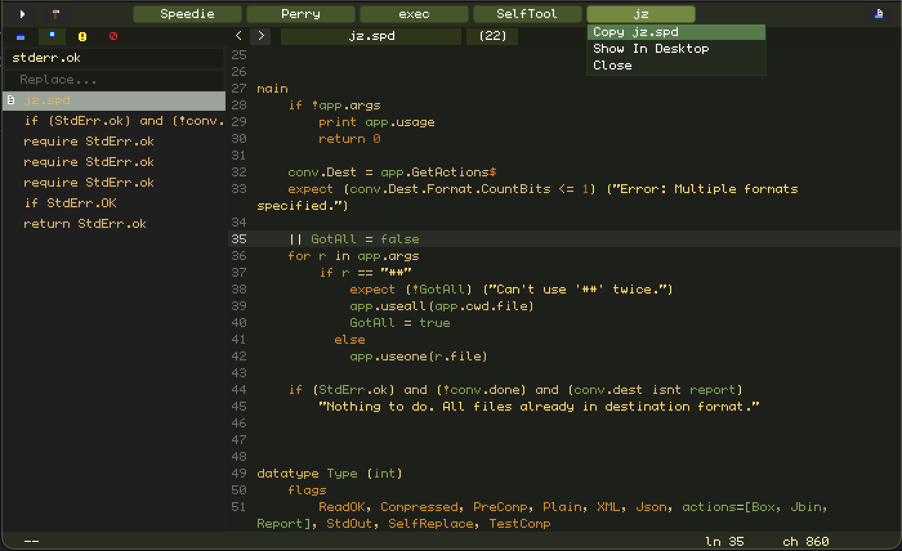

# Perry - The IDE for Speedie

Perry is an IDE, that means it does all  of the things that help you to write good code in. Or it will do anyhow as I have some good features in mind.

Perry is designed with minimalism in mind. That is... it purposefully DOESN'T blast your eyes with all sorts of clutter and details.

In fact Perry goes out of it's way to hide clutter. Hopefully this will let you focus on the code more easily. Especially if you are new!

The reason for creating my own IDE, is that I wanted full support for Speedie. I didn't want to have to be a second-class citizen.

You'll see that it looks simple. But underneath that simplicity, is a huge amount of features carefully hidden.

## Perry Features
* File List has auto-discovery
* Anti-Clutter interface
* Errors List lets you jump to error-locations.
* Batch-Find
* Remembers your last projects used, and what files you were last editing.
* Multi-Project, Tabbed Interface.
* Syntax Coloring
* Auto-Complete
* Build and Run programs
* Inbuilt todo list
* Text editor is pretty good. I like it about as much as BBEdit.
* Log area to see your programs text output
* Multi-root interface, in case your project relies on libs you created, and you want to edit those libs too.
* Right-Click on any function or variable to see where it is defined, and even what other functions call it!
* Hold control key (linux/windows) or command key (OSX) down, over any variable or function, to see how it is defined.

## Great Care

Each of these features was designed expertly and to a high degree of care. For example:

> The tabbed interface, lets you work on multiple projects at once! It actually very quickly lets you see if one of your changes in one project, is breaking another project. This is useful if you are creating a library that many projects of yours use, and want to be quickly warned if the change breaks other projects of yours.

&nbsp;
> The Inbuilt todo list, is available by clicking on your current project's tab. Clicking again returns you. I find this invaluable for my project management. This means your todo-list is always at-hand. Really vital.

## Speed

Overall... Perry is also a very **fast** and light small program. Weighing at only 2.1MB on OSX. Incredible that it is so small. This is because it is made in Speedie, and Speedie writes good programs.

The kind of programs you used to like and enjoy maybe 20 years ago... small fast light programs that do a lot... without all the bloat.

Anyhow, the point is, that Perry generally is a fast text-editor. Despite that I didn't actually optimise it for speed. This is simply because speedie tends to make everything fast, and I tend to write fast code anyhow.

Also, when I'm editing my projects, it takes surprising little RAM. 

When I open Perry I see I have 6 projects open (3 are large projects). Yet I am only taking 1.5MB of memory for all the objects, 87KB for the strings, and 1.7MB for the screen. Its an ultra-light-weight design.

## Comparisons

#### BBEdit + Xcode

When opening large files, Perry will run much much faster.

#### Xcode

Syntax coloring is instant, unlike in Xcode.

Xcode has a giant bloated IDE. And a super-confusing Build and Scheme and Task window system thingy that I still don't fully understand after using it for over 15 years.

Xcode STILL regularly breaks file-paths in such ways that takes very careful manual editing of

Perry is sleek and simple in that regard. Creating a new project is a single-click process, opening an existing project is also. In fact Perry doesn't require you to manually add files, they are auto-discovered.

#### VSCode
vscode is slow, bloated and confusing. I hate using it. Perry is fast and light.

Last time I needed vscode for C++, it took me over an hour to setup. I needed tutorials because nothing is obvious, I had to install plugins, then configure "build" and "task" json files... then debug them when they aren't working, editing json is a nightmare. At each step I'm finding the tutorials aren't quite right, so I need to (stressfully) guess about how to fix the task-file. I **HATED** it.

And after all that, the C++ debugging experience was slow!

Perry on the other hand, there really is no project setup. You just open a project in perry, and it sees all your files, you can compile, run and use it. There is zero project setup. There isn't even a .proj file. Theres none!

## Simplicity

Let me re-iterate that last point and make a whole section out of it.

When you have a project in vscode or xcode, there is a .vscode or .xcodeproj file. In Xcode's case, that file is usually quite large. 

**In Perry, there is no such file.** The source code that the compiler needs for your project, is enough for Perry to understand when opening that project.

There is one exception, but thats more of a nicety. Perry has a "multi-root" interface, and those roots need to be specified somewhere. We specify that in an invisible ".perry" file in your project's root.

But if that ".perry" file does not exist, everything still works. Its only needed for multiple-root projects.

Perry can also edit single-file projects, or even plain text-files. Its good at all of it. I actually prefer Perry as a text-editor to BBEdit.

## Retro Feel
Actually, with Perry and the GUI, I'm going for more of a retro-feel. More like Sega-Megadrive or Terraria style level of complexity and detail.

So if you like retro-gaming... this might be a good IDE for you.

Regarding the color-scheme, that can and will change over time. Currently I have a green-theme, but later I will allow skins to be available.

I'll probably allow rounded buttons with pictures for backgrounds later, perhaps we can make the IDE look like something from a Civilisation Game or something :) Or a "my little IDE" kind of Hello Kitty theme, or all sorts of possibilities.

