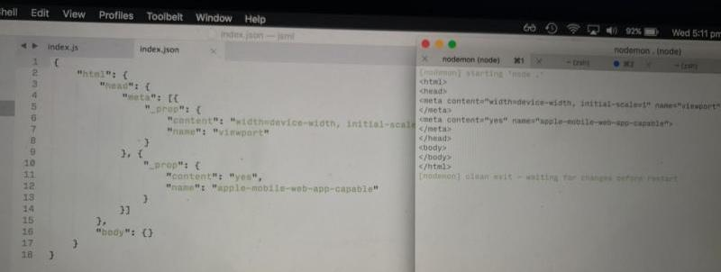

## "XML Sucks"
*(aka "JSON sucks")*

OK, for preface, I don't think XML actually sucks. But I'd rather not use it if I can just use Jeebox instead.

That said, a lot of people have had complaints about XML, so lets list them, and also talk about JSON too. Which is quite similar but fundamentally different.

&nbsp;&nbsp;&nbsp;&nbsp;&nbsp;&nbsp;&nbsp;*“Most xml i’ve seen makes me think i’m dyslexic. it also looks constipated, and two health problems in one standard is just too much.”* – Charles Forsyth on 9fans

&nbsp;&nbsp;&nbsp;&nbsp;&nbsp;&nbsp;&nbsp;*“Some part of me desperately wants to believe that XML-RPC is some kind of elaborate joke, like a cross between Discordianism and IP Over Avian Carriers.”* – Ex-Cyber on #plan9

&nbsp;&nbsp;&nbsp;&nbsp;&nbsp;&nbsp;&nbsp;*“Any damn fool could produce a better data format than XML”* – James Clark 2007-04-06*

&nbsp;&nbsp;&nbsp;&nbsp;&nbsp;&nbsp;&nbsp;*“XML is simply lisp done wrong.”* – Alan Cox

&nbsp;&nbsp;&nbsp;&nbsp;&nbsp;&nbsp;&nbsp;*“XML is like violence. Sure, it seems like a quick and easy solution at first, but then it spirals out of control into utter chaos.”* – Sarkos in reddit

&nbsp;&nbsp;&nbsp;&nbsp;&nbsp;&nbsp;&nbsp;*“XML is a classic political compromise: it balances the needs of man and machine by being equally unreadable to both.”* – Matthew Might

&nbsp;&nbsp;&nbsp;&nbsp;&nbsp;&nbsp;&nbsp;*XSLT is a failure wrapped in pain. There’s no job for which XSLT is the right tool. If you think you found a job for which XSLT is a good tool, chances are the job itself is fucked up.* – masklinn

OK well thats very funny... so lets look at a common list of reasons... why people aren't fans of XML.

* XML is verbose: For "big data" this matters because they are often CPU/storage bound.
* Hard for humans to scan: So many tags and nesting makes it hard to "see past" that much data. What you need becomes buried.
* Too many encodings: XML should have simply stuck with UTF-8. There are 5 Unicode encodings that XML can be, plus non-unicode encodings it can be in!
* Over complex: 
    * Namespaces, doctypes, dtds, cdata, attributes, processing-instructions, file-entities (that exist separately on disk or on the internet!), all needed just to get started.
    * SOAP, XSLT, XPath... Too many XML technologies.
* XML is not very regular in terms of the object model. XML elements are different than XML attributes and XML text. Same with DTD/doctypes and processing-instructions. They aren't interchangeable, meaning to represent an XML document requires many different classes.
* Awkward strings. Text like: `if "a" < "b"`, is quite awkward to express in XML.
* Encoding binary strings is hugely wasteful: You need to use entities. Simply hexing something doesn't count, because the XML parser itself won't unhex it.
* CData is ugly: `<escape/> me >_<` -> `<![CDATA[<escape/>]]> me <![CDATA[>_<]]>`
* XML is historically a markup language. Even if it can be used for general data-storage, it carries the baggage of being a markup language.
    * White-space rules suck: They are so bad that no one follows them. Merge multiple-whitespace? Does indentation count as part of the text? What about leading/trailing white-space? "Depends". Most parsers give multiple options, so you can choose which way that your particular program needs.
    * XML is rarely self-documenting (IE, you can understand the document) for complex formats. But also quite often a simple list of data is better, where the meaning of the items is inferred by it's position in the list. Imposing verbose self-documentation on something that can't benefit from it, is just wasteful.

## Dictionaries

XML is bad at storing dictionaries. Think you can store a dictionary like this?

    <dict>
        <name>Fred Flintstone</name>
        <address>Boulder Road</address>
    </dict>

Well.. you can't. I mean... often you can, and you should be able to. The problem is that you won't be able to make a DTD that works with this. Also, what if the key happens to contain something that isn't a valid XML name? It is possible! (Depending on your program). This is why many formats (like Apple's plists) use dictionaries this way:

    <dict>
        <key>name</key>
        <string>Fred Flintstone</string>
        <key>address</key>
        <string>Boulder Road</string>
    </dict>

Which is just awful. Unreadable, and bloated. JSON is better at this, because keys have string names. What about JSON then? Is that the ultimate format?

Well... JSON is better in some ways and worse in others. JSON is quite unwieldy and hard to read! Very easy to miss a "," or closing [] or {} thing. JSON is better at making dictionaries, but not perfect either.

Here is an example of how trying to use JSON for "xml-like tasks" becomes unreadable:

Theres more [example comparisons here](../Examples/comparisons).

## Jeebox

OK, lets try this above example in jeebox. I can't resist talking about jeebox any longer:

    html
        head
            meta (content: "width=device-width, initial-scale=1", name: "viewport")
            meta (content: "yes", name: "apple-mobile-web-app-capable")
        body
        
        
Much cleaner! In fact it's easier to read than either.

Jeebox is really a very pure and true format that has almost no downsides... apart from low-users. (But you can change that by using Jeebox and promoting it.)

Lets go through all the problems with XML or JSON.

#### Verbosity
Jeebox is compact! Probably the most compact language out there.

### Easy to scan for humans
I mean it looks good. No close-tags, and using white-space for indentation makes the language lighter, and removes all the `"":[],{},` things that JSON clutters the space with.

#### Simplicity
Jeebox doesn't have name-spaces, doctypes, dtds or processing-instructions, or file-entities. Neither SOAP, XSLT or XPath.

Jeebox doesn't have and doesn't need something like a DTD. Code is code. The best way to validate a document is with the app that created it. Jeebox works with the philosophy, that what people really want, is code, good simple code. Because all systems seem to emmigrate in that direction anyhow.

Computer-games end up adding scripts, databases end up adding "triggers", websites added javascript, spreadsheets added code, and XML schema is near a programming-language (with elseif/loops/dictionaries).

If we really needed a validation for a Jeebox-based format, it would have to be a program, written in Speedie. A small Speedie script, say 4KB big could easily function as a Jeebox DTD.

Jeebox's API has a simple system where the code that validates the code is the same code that reads it. If Jeebox becomes popular, I could easily add a "validation only" mode for scripts, that don't allow file-access or any other system features. Just [sandbox](https://stackoverflow.com/questions/4249063/) the thing[.](https://www.kernel.org/doc/Documentation/prctl/seccomp_filter.txt?Perhaps-i-can-also-disable-read-write-outside-of-obj/global-space...-and-disable-many-functions...-seccomp_filter-does-this...chroot+setuid-can-help-but-are-not-safe...setrlimit-can-limit-network-and-cpu!--sandbox_init()-on-macosx-works--chromium-stil-uses-it!...codesign()-also-works)

#### Regularity
Jeebox has a 100% simple model. It's tree is made out of nodes (the `message` class), each node is interchangeable with any other, no difference between text or container nodes. Each node has only two things that define it, a type and a name. By changing the type and the name, you change how the document looks.

#### Powerful strings
Text like: `if "a" < "b"`, is very simple to express in jeebox.

    `if "a" < "b"`

there... done. We just use backticks in this case, although we have 5 different string-types in Jeebox. Very flexible.

#### Only one Encoding

Jeebox is stored as UTF-8. That's it.

#### Encoding Binary Strings is easy
Depending on how you want to encode them, there are a few ways. For mostly UTF-8 text containing a little binary, we can escape bytes.

    "hello here is a \1b[0;1mbold styling" // \1b[0;1m is the "bold" signal to command-line terminals

Or if what you have is really "binary-like", you can use the binary string.

    #(6da7494de9243de7)#
    
Additionally, we have "sister format" to Jeebox called "jbin". Jbin does everything jeebox does, except it is stored as binary. The C++ code to parse jbin takes about 35 lines of code, its a very small and fast format. Yes, you can now store jpegs or other pictures/music directly in a Jeebox file with no encoding-overhead, or hexing needed. This is done in speedie via like this:

    || data = document.renderjbin

In C++ it is done like this:

    auto data = document.renderjbin();
    
JeeboxLib will actually "just parse" a jbin file or a jeebox file, as-is. No need to convert it. You are free to store your files in either way.

#### Lack of Legacy
Jeebox is modern language. It has no baggage!

Text is text in Jeebox. No strange white-space rules. It works just the same way as you would expect it to work in a programming-language.

Jeebox doesn't enforce self-documenting when you just want a list, but lets you if you want that. Choice is yours!
    
list form:

    User ("Fred", "Flintstone", "Boulder road")

self-documenting form:

    User
        first "Fred"
        last "Flintstone"
        address "Boulder Road"

You are free to choose which makes the most sense for your program.

#### Trees not dictionaries
Unlike JSON, Jeebox uses a tree-model. That means, you can easily express an array of named items with the same name. JSON doesn't allow named-trees, because JSON doesn't allow multiple same-key names.

    {
      "userlist: {
          "user": 12355,
          "user": 12345, // invalid! duplicate key "user"!
          "user": 12365 // actually json doesn't allow comments either. But jeebox does
      }
    }

Lets do it the "real" JSON way.
    
    {
      "userlist": [
          {"user": 12355},
          {"user": 12345},
          {"user": 12365}
      ]
    }

It's just ugly and fiddly. Now lets see it in Jeebox

      userlist
          user 12355
          user 12345
          user 12365

Perfect!

Do you need a dictionary anyhow? Where keys can contain any byte? Easy:

    dict
        name    "Fred Flintstone"
        address "Boulder Road"
        +"/file/path/as-key.txt"   "File-Data"

This is useful for file-paths. Compared to this, its perfect:

    <dict>
        <key>name</key>
        <string>Fred Flintstone</string>
        <key>address</key>
        <string>Boulder Road</string>
        <key>/file/path/as-key.txt</key>
        <string>File-Data</string>
    </dict>

#### Not Fiddly
JSON is notoriously fiddly. Extra or missing "," mess everything up. Jeebox doesn't care. You don't need any "," but they are treated as lines, so you can add them if you want.

    {
      "userlist": {
          "user1": 12355,
          "user2": 12365, // json hates this comment
      },
    }

Jeebox version:

    userlist
        user 12355,
        user 12365,,, // jeebox doesn't care, this is just 2 items all called "user", so far.

    
## Nesting via Indentation
Do you hate white-space for tree-nesting? Well, lets say you do, jeebox actually doesn't require white-space for it. Jeebox has optional `{}` support.

    a
        b
            c
    
    a {
    b {
    c
    }
    }

Same thing... I am keeping the `{}` support there simply to make it easier to convert many old formats to Jeebox. But white-space haters might appreciate me keeping it too.

## Caveats
I won't deny that the Jeebox's parser is complex, but that is an internal detail and still simpler C++ / python's parser.

If you are simply doing XML-like/JSON-like work, you only use a tiny subset of the parser. Your documents are small and the object-model is simple.

When you need to do more complex things... jeebox is still there for you. If you think about it, what would you rather have? One parser that takes 280K compiled, that can be used for 1000 tasks, and includes inbuilt-error-reporting system and memory-management...

Or five different parsers. One for XML, another for JSON, another for C++, another for python, another for SQL, etc etc. Each of which can weigh from 200K to 1MB.

Also, if you really have a low-lines-of-code project that you "just want to work fast" and don't care about user-niceities... you can just use jbin, which parses in less lines of code than any other format I've seen :)

Jeebox makes everything simpler.

