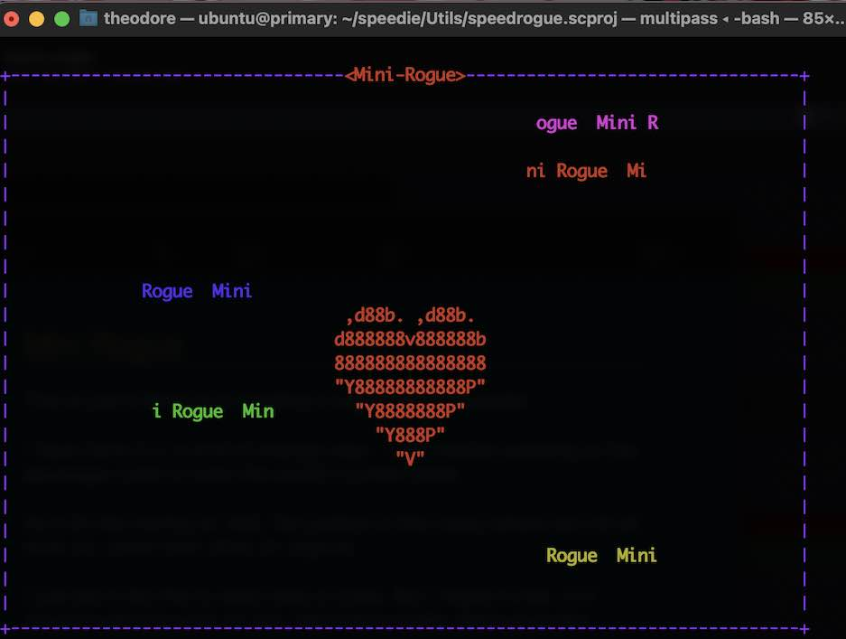
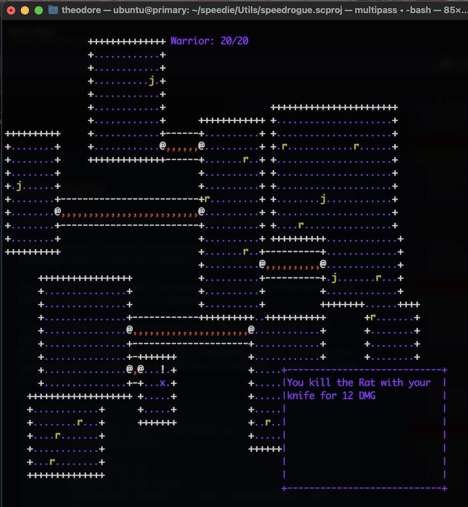

##Mini Rogue

This is just a demo of a creating a rogue-like in Speedie.

I am directly working on the `message` class to store the world's current state.

Its a bit like having an XML file (jeebox in this case) where you do all work on, rather than work on objects. 

I just did it like this to save lines of code. But I regret it now :D If anyone wants to work on this, feel free to totally restructure the project to use proper classes, and a load/save design.  Anyhow, the overall project is only around 500 lines of code. So... it won't be hard to restructure.

    todo:
        * monsters try to attack us
        * cell-discovery
        * potions
        * item pick up
        * monster item drop
        * abandoned rooms... need connection! (or removal?)

