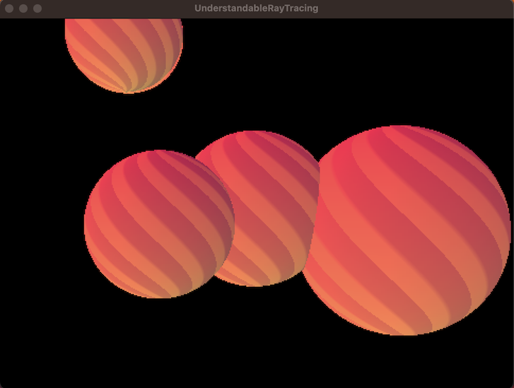

## Understandable Raytracing

This is the understandable raytracing demo.

It aims to be a simple fun little ray-tracing demo, in about 200 LOC.

So... the idea is just to make a small simple ray-tracer that demonstrates a little bit of raytracing theory. Its mostly inspired by this place here: [scratchapixel](https://www.scratchapixel.com/lessons/3d-basic-rendering/minimal-ray-tracer-rendering-simple-shapes/minimal-ray-tracer-rendering-spheres.html)

Which is a good tutorial. But my code is about 3x shorter, and about 10x clearer and easier to understand! So it might make learning raytracing a lot easier! Assuming Speedie was in a distributable state, (not right now).

The code should run as fast as any C++ code! Only using OpenMP is missing... but I can add that in a future version of Speedie.

Good luck and hope you enjoy! Raytracing is a fun little thing to start with.